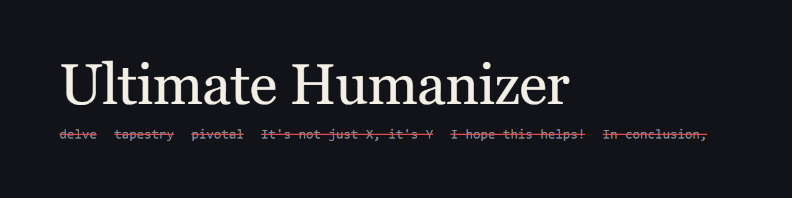

<p align="center"></p>

<p align="center">
  <a href="https://github.com/DrARaj/ultimate-humanizer/actions/workflows/lint.yml"></a>
  <a href="https://github.com/DrARaj/ultimate-humanizer/releases"></a>
  <a href="LICENSE"></a>
</p>

# Ultimate Humanizer

A Claude Code skill that keeps AI writing tells out of your text. It turns every pattern in Wikipedia's "Signs of AI writing" field guide into a numbered rule, adds the extra patterns from the humanizer and no-ai-slop skills, and ships a lint script that catches the mechanical ones.

## Before and after

This paragraph was written to be bad on purpose:

> Nestled in the heart of the developer ecosystem, Ultimate Humanizer stands as a testament to the power of thoughtful writing. It's not just a linter, it's a commitment to clarity. Additionally, it helps teams delve into their drafts, highlighting the intricate interplay between tone and meaning. In conclusion, it is a pivotal tool for anyone who writes. I hope this helps!

`lint.py` finds 16 FAIL lines in it (seven R9 vocabulary hits, three R4 promotional phrases, two R1 significance claims, and one each for R3, R11, R22 and R58). This is what the skill returned when asked to edit it:

> Ultimate Humanizer is a Claude Code skill. It contains a set of writing rules and a Python lint script that checks a draft against them.

0 FAIL. It also dropped the claims about "helping teams", because nothing in the prompt supported them, and said so in its change note. Both samples are in [`assets/`](assets), and CI lints the clean one on every push.

## What it does

- Writing and editing: prose, wiki text, docs, emails, comments, commit messages and edit summaries come out without the listed tells.
- Auditing: ask whether a piece reads as AI and you get findings with a rule number, the quoted line and a short fix. It does not score text or claim to know who wrote it.

| Part | Rules | Covers |
|---|---|---|
| A | R1 to R8 | Content: inflated significance, coverage bragging, trailing "-ing" commentary, promotional tone, weasel attribution, formulaic endings |
| B | R9 to R13 | Language: overused vocabulary, avoided "is/has", negative parallelisms, triplets |
| C | R14 to R21 | Style: headings, bold, inline-header lists, em dashes, emoji, tables, curly quotes |
| D | R22 to R24 | Chatbot correspondence, source-availability hedges, placeholders |
| E, F | R25 to R40 | Markup and citations, including leaked ChatGPT, Gemini, Grok, DeepSeek and Perplexity artifacts |
| G, H | R41 to R47 | Discussion comments, edit summaries and commit messages |
| I, J | R48 to R62 | Voice, English variety, canned pages, older model habits |
| K, L | R63 to R66 | What human text looks like, what not to overcorrect, how to audit fairly |
| M | R67 to R90 | Voice matching, minimum edits, rhythm, rhetorical tricks, filler, hedging |

R0 sits above all of them: never invent a fact, source, person, example or opinion to replace a vague phrase.

<details>
<summary>All 91 rules</summary>

- R0: Fix the underlying problem as well as the surface
- R1: No undue emphasis on significance, legacy or broader trends
- R2: No canned emphasis on notability, attribution or media coverage
- R3: No superficial analysis
- R4: No promotional or advertisement-like language
- R5: No vague connection or association
- R6: No vague attributions and no overgeneralized opinions
- R7: No formulaic "challenges and future prospects" ending, no generic upbeat ending
- R8: No "Awards and recognition" sections and no reflexive "X and Y" headings
- R9: No AI vocabulary
- R10: Use plain copulas ("is", "are", "has")
- R11: No negative parallelisms, negative listings or tailing negations
- R12: Do not treat list titles or broad topics as proper nouns in the opening line
- R13: No rule of three
- R14: Sentence case headings
- R15: No boldface overuse
- R16: No inline-header vertical lists, no bullets that should be prose
- R17: Em dashes
- R18: Correct, minimal heading structure
- R19: No emoji as formatting
- R20: No pointless tables
- R21: Straight quotes and apostrophes
- R22: No chatbot correspondence and no sycophancy
- R23: No hedging disclaimers about sources or usage
- R24: No placeholders or fill-in-the-blank templates
- R25: Use the target format's markup, never a mix
- R26: No asterisks for emphasis where they do not render
- R27: No `##` headings where they do not render (MediaWiki turns them into numbered lists)
- R28: No `[label](url)` links outside Markdown
- R29: No thematic breaks (`----`, `---`, `***`) between sections
- R30: Valid markup only
- R31: Never emit internal chatbot artifacts
- R32: Only real, current categories, with exact names and punctuation (American hip-hop musicians, not hip hop)
- R33: Only real templates and parameters
- R34: Cite only URLs that come from a real source
- R35: ISBNs must pass their checksum
- R36: A DOI or PMID must point to the exact work cited
- R37: Book citations carry page numbers, and those pages must support the claim
- R38: Correct reference reuse syntax
- R39: Strip tracking parameters from every URL
- R40: Every reference in a references list is used in the body; every named reference used is defined
- R41: Comment rules
- R42: Short, specific, human
- R43: No canned compliance assurances
- R44: No statements about what was not changed
- R45: No sourcing boasts
- R46: No itemized parameter names, template names, "inline citations" or "internal links" unless that markup was the whole change
- R47: No "addressing reviewer feedback", "per reviewer feedback", "rewrote per reviewer"
- R48: Keep the author's own voice and English variety
- R49: No submission statements, reviewer notes or compliance disclosures inside content
- R50: No pre-placed templates a new page could not plausibly have
- R51: No canned profile pages
- R52: No bulk throwaway rewrites across many unrelated pages or files
- R53: No "broader context" drift (the ChatGPT and Grok signature)
- R54: No pro-authoritarian slant
- R55: No stock AI fiction names and images ("Elara Voss", "whispering woods") or their equivalents
- R56: No knowledge-cutoff talk
- R57: No didactic disclaimers
- R58: No summary endings
- R59: No refusal or AI self-reference boilerplate
- R60: Never stop mid-output
- R61: access-date and similar fields carry the real consultation date
- R62: No elegant variation (synonym cycling)
- R63: Prefer the patterns humans use
- R64: Every claim, link, number and edit must be explainable
- R65: These are not AI tells; leave them alone
- R66: Rules for auditing someone else's text
- R67: Voice calibration
- R68: Voice belongs to the author and the format
- R69: Make the minimum effective edit
- R70: Lead with the point
- R71: Concrete, portable-proof, shown
- R72: Direct verbs, active voice, real subjects
- R73: Often-empty adverbs
- R74: No interpretive metadiscourse
- R75: No throat-clearing openers or faux-insight setups
- R76: Filler phrases, cut when they delay the point
- R77: No stacked hedging
- R78: No false ranges
- R79: No persuasive authority tropes
- R80: No signposting
- R81: No colon reveals
- R82: No rhetorical questions answered immediately, no rhetorical setups
- R83: No dramatic fragmentation
- R84: No punchy or fake-profound kickers
- R85: No forced metaphors
- R86: No robotic rhythm
- R87: No sentence-opener tics
- R88: No reassurance kickers
- R89: Preserve meaning, add nothing
- R90: Hyphenated compound modifiers

</details>

## Install

```sh
git clone https://github.com/DrARaj/ultimate-humanizer ~/.claude/skills/ultimate-humanizer
```

Restart Claude Code. The skill shows up as `/ultimate-humanizer`.

## Use

- Type `/ultimate-humanizer` and paste a draft, or point it at a file.
- Ask "does this read as AI?" for an audit without a rewrite.
- Lint any text yourself:

```sh
python -I ~/.claude/skills/ultimate-humanizer/scripts/lint.py draft.md
python -I ~/.claude/skills/ultimate-humanizer/scripts/lint.py --selftest
```

FAIL lines are banned outright. CHECK lines depend on context and name the rule to judge them against. The script exits with 1 when any FAIL is present, so it can run in CI or a pre-commit hook. It needs Python 3 and nothing else.

## Make it always on

Claude Code decides on its own when to load a skill. In testing, a plain "write a commit message" request did not load it. To apply the rules to everything, add this line to `~/.claude/CLAUDE.md`:

```
Use the ultimate-humanizer skill for any prose, commit message or edit summary you write.
```

## How it was tested

- `quick_validate.py` from Anthropic's skill-creator: passes.
- `lint.py --selftest`: passes, and runs in CI on every push.
- A coverage script checked that 150 distinct patterns from the three sources each appear in `SKILL.md`. None were missing.
- skill-comply ran three commit-message scenarios (supportive, neutral, competing). It reported 0%, for two reasons: its classifier output failed to parse, and the outputs of these scenarios are plain text, which it cannot observe. The scenarios were then run directly and the messages linted. All three had zero FAIL. With the skill loaded, the competing prompt (which asked to "emphasize significance") produced a plain, factual message and asked for a real example instead of inventing one. Without the skill loaded, the same prompt invented example addresses, which led to the R0 rule against illustrative details.

## Limits

- The linter catches wording and formatting. Voice, rhythm, invented facts and citation accuracy need the checklist in `SKILL.md` and a human read.
- Style signs are evidence, not proof. Plenty of people write with bold text or curly quotes.

## Credits

Built on the Wikipedia guide "Signs of AI writing" by WikiProject AI Cleanup (CC BY-SA 4.0), [humanizer](https://github.com/blader/humanizer) by Siqi Chen and its [Hermes Agent port](https://github.com/nousresearch/hermes-agent), and [no-ai-slop](https://github.com/petergyang/no-ai-slop) by Peter Yang. See `NOTICE` for details.

## License

MIT, see `LICENSE`. Third-party material keeps its original license, listed in `NOTICE`. The banner source is [`assets/banner.html`](assets/banner.html).
